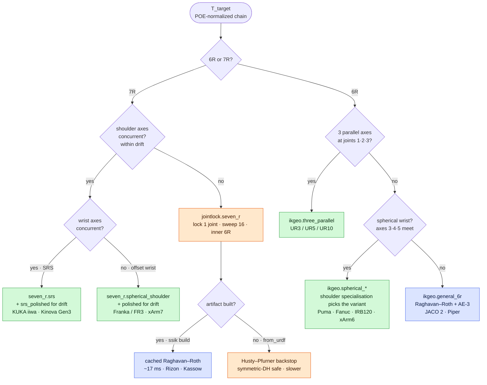
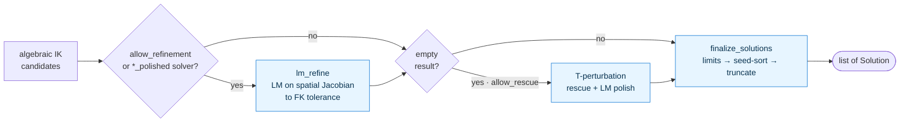

# ssik

[](https://pypi.org/project/ssik/)
[](https://pypi.org/project/ssik/)
[](LICENSE)
[](https://doi.org/10.5281/zenodo.20278005)

Reliable enumerative inverse kinematics for 6R and 7R revolute robot arms, including non-Pieper 6R and non-SRS 7R geometries.

The mathematics of inverse kinematics and the numerical behavior of an IK solver are not the same thing. A manipulator may admit an exact algebraic reduction while a particular finite-precision realization loses roots, becomes ill-conditioned, or returns no solution for a pose known to be reachable. **ssik is built around the stronger requirement that IK solutions must actually be recoverable and independently verifiable across the robot workspace.**

For 6R arms, ssik enumerates the isolated IK branches. For redundant 7R arms, where the solution set is generically a one-dimensional manifold, ssik samples or parameterizes redundancy and enumerates the discrete IK branches conditional on each redundancy value. Every retained candidate is checked by forward-kinematic closure against the original robot model, and runs through the native C++ backend by default (typically 2–100× faster than pure Python, with an automatic pure-Python fallback).

**72 arms** ship prebuilt, including Universal Robots, Franka, KUKA iiwa, Kinova JACO/Gen3, Flexiv Rizon, Kassow, ABB YuMi, FANUC CRX, and many others. `ssik build <your.urdf>` specializes the same pipeline to a new robot: it examines the manipulator geometry, selects the simplest structurally valid solver, specializes robot-dependent algebra offline, and — where algebraically equivalent formulations exist — chooses representations for numerical conditioning.

The governing principle is simple:

> **Solvability is a property of the kinematic equations. Reliability is a property of the solver.**

## Install

```bash
pip install ssik
```

Python 3.11+. Wheels for Linux x86_64, macOS arm64, macOS x86_64, Windows x86_64. The native C++ backend is bundled in the Linux and macOS wheels (and used by default); Windows and source installs transparently run the identical pure-Python path.

## Quickstart

```python
from ssik.prebuilt import franka_panda_ik
import numpy as np

T_target = np.eye(4)
T_target[:3, 3] = [0.5, 0.1, 0.3]

sols = franka_panda_ik.solve(T_target)
```

`sols` is a `list[Solution]`. Each `Solution` carries:

- `q`: the joint configuration,
- `fk_residual`: `‖FK(q) − T_target‖`,
- `refinement_used`: whether numerical polishing was required.

For a 6R arm, the list contains the certified isolated IK branches ssik recovered. For a 7R arm it contains branches obtained across the chosen redundancy samples.

An empty list means **no certified solution was returned** — which, by itself, is not a mathematical proof that the pose is unreachable. Use `explain=True` when diagnosing an empty result.

### See every branch at once

```bash
pip install 'ssik[demo]'
python examples/05_viser_interactive_ik.py
```

Opens a browser viewer: drag a 3D handle and watch every analytical IK solution render as a live arm in real time. Cycle through the full prebuilt roster, including the non-Pieper 6R and 7R arms EAIK refuses.

#### Eight arms, every analytical branch

Each loop below is one arm's interactive demo running for ~3 seconds: the live red arm tracks the marker; the faded reds are the other analytical IK branches at the same instant. Captured from [`examples/05_viser_interactive_ik.py`](examples/05_viser_interactive_ik.py).

**UR5**: three-parallel 6R (Pieper). EAIK supports this class.


**Unitree Z1**: three-parallel 6R (UR-class). EAIK supports this class.


**Franka Panda**: anthropomorphic 7R. EAIK refuses ("only 1–6R").


**UFactory xArm6**: non-Pieper 6R. EAIK refuses ("6R-Unknown Kinematic Class").


**Kinova JACO 2**: non-Pieper 6R. EAIK refuses ("6R-Unknown Kinematic Class").


**AgileX PiPER**: non-Pieper 6R. EAIK refuses ("6R-Unknown Kinematic Class").


**KUKA iiwa14**: SRS 7R. EAIK refuses ("no 7R DH path").


**Flexiv Rizon 4**: non-SRS 7R. EAIK refuses ("only 1–6R").


## Why ssik exists

General 6R inverse kinematics has been algebraically solvable for decades. Classical work by Raghavan–Roth, Manocha–Canny, and Husty–Pfurner showed how the kinematic equations of a general revolute 6R manipulator reduce to finite polynomial or eigenvalue problems. Geometric approaches such as IK-Geo show how manipulator structure can simplify the same problem dramatically.

The remaining practical problem is **numerical recovery**. Two algebraically equivalent formulations can behave very differently in floating-point arithmetic. In ssik's Raghavan–Roth implementation, for example, changing which joint is used as the elimination variable on the Kinova JACO 2 changes the conditioning of the quadratic coefficient matrix from approximately

```text
3.75 × 10^16   →   127
```

while leaving the exact IK problem unchanged. One formulation loses solutions to floating-point error; the other recovers them.

This distinction drives the design of ssik:

```text
kinematic model
      │
      ▼
structural classification ── exploit special geometry when available
      │                       (else general algebraic elimination)
      ▼
numerical representation selection   (choose the best-conditioned equivalent)
      │
      ▼
candidate IK solutions
      │
      ▼
FK certification / optional refinement / recovery
      │
      ▼
certified solutions
```

Special geometry determines **how cheaply and robustly** IK is solved, not whether enumerative IK is available at all. The goal is not to possess a derivation that is complete in exact arithmetic — it is to make that derivation survive contact with real robot geometry, finite precision, singular and near-singular configurations, joint limits, and deployment software.

## The artifact model

ssik treats IK generation as an offline specialization problem. Each robot becomes a self-contained artifact holding its normalized kinematics, the selected solver, robot-specific constants, and any symbolic or algebraic preprocessing that can be moved off the runtime path:

```text
URDF / robot specification
        │
        ▼
geometry + solver specialization
        │
        ▼
conditioning-aware preprocessing
        │
        ▼
<arm>_ik.py  +  self-contained C++ artifact
        │
        ▼
pure numerical solve at deployment
```

There is no URDF parsing, `urchin`, or `sympy` on the artifact runtime path. This follows the deployment precedent OpenRAVE's IKFast established — do robot-specific symbolic work once, then ship a numerical artifact — extended across a heterogeneous solver hierarchy (geometric closed forms, general 6R algebraic elimination, redundant 7R reductions), and without IKFast's brittleness on non-Pieper geometries. The artifact encodes not just *which robot* is being solved, but *which computational representation of that robot's IK was found to be appropriate*.

There are two artifact paths:

### Use a prebuilt arm (`ssik.prebuilt`)

The wheel ships <!-- AUTOGEN:arm_count -->72<!-- /AUTOGEN --> ready-to-import artifacts, grouped by vendor below (expand a vendor to see its arms). Each imports as `ssik.prebuilt.<vendor>.<module>` (e.g. `from ssik.prebuilt.universal_robots import ur5_ik`) and the flat `from ssik.prebuilt import ur5_ik` alias still works. Each was built against a specific URDF (or extracted spec); `T_target` is the pose of `EE_LINK` expressed in `BASE_LINK`:

<!-- AUTOGEN:readme_prebuilt_table -->
<details>
<summary><b>Universal Robots</b>: <code>ssik.prebuilt.universal_robots</code> (11 arms)</summary>

| Module | Arm | Class | base_link | ee_link |
|---|---|---|---|---|
| `ur5_ik` | Universal Robots UR5 | three-parallel 6R | `base_link` | `ee_link` |
| `ur3e_ik` | Universal Robots UR3e | three-parallel 6R | `base_link` | `tool0` |
| `ur5e_ik` | Universal Robots UR5e | three-parallel 6R | `base_link` | `tool0` |
| `ur10e_ik` | Universal Robots UR10e | three-parallel 6R | `base_link` | `tool0` |
| `ur16e_ik` | Universal Robots UR16e | three-parallel 6R | `base_link` | `tool0` |
| `ur20_ik` | Universal Robots UR20 | three-parallel 6R | `base_link` | `tool0` |
| `ur30_ik` | Universal Robots UR30 | three-parallel 6R | `base_link` | `tool0` |
| `ur7e_ik` | Universal Robots UR7E | three-parallel 6R | `base_link` | `tool0` |
| `ur12e_ik` | Universal Robots UR12E | three-parallel 6R | `base_link` | `tool0` |
| `ur15_ik` | Universal Robots UR15 | three-parallel 6R | `base_link` | `tool0` |
| `ur18_ik` | Universal Robots UR18 | three-parallel 6R | `base_link` | `tool0` |

</details>

<details>
<summary><b>Unimation</b>: <code>ssik.prebuilt.unimation</code> (1 arm)</summary>

| Module | Arm | Class | base_link | ee_link |
|---|---|---|---|---|
| `puma560_ik` | KUKA Puma 560 | Pieper 6R (spherical wrist) | `base_link` | `wrist_3_link` |

</details>

<details>
<summary><b>Kinova</b>: <code>ssik.prebuilt.kinova</code> (5 arms)</summary>

| Module | Arm | Class | base_link | ee_link |
|---|---|---|---|---|
| `jaco2_ik` | Kinova JACO 2 | **non-Pieper 6R** | `base_link` | `ee_link` |
| `gen3_ik` | Kinova Gen3 7-DOF | **approximate-SRS 7R** | `base_link` | `end_effector_link` |
| `gen3_lite_ik` | Kinova Gen3 Lite | **non-Pieper 6R** | `base_link` | `end_effector_link` |
| `j2s6s300_ik` | Kinova JACO j2s6s300 | Pieper 6R (spherical wrist) | `j2s6s300_link_base` | `j2s6s300_end_effector` |
| `j2s7s300_ik` | Kinova JACO j2s7s300 | **approximate-SRS 7R** (spherical wrist) | `j2s7s300_link_base` | `j2s7s300_link_7` |

</details>

<details>
<summary><b>KUKA</b>: <code>ssik.prebuilt.kuka</code> (4 arms)</summary>

| Module | Arm | Class | base_link | ee_link |
|---|---|---|---|---|
| `iiwa14_ik` | KUKA iiwa LBR 14 | SRS 7R | `base` | `iiwa_link_ee_kuka` |
| `iiwa7_ik` | KUKA iiwa LBR 7 | SRS 7R (offset wrist) | `iiwa_link_0` | `iiwa_link_ee` |
| `kr6_r900_ik` | KUKA KR 6 R900 sixx (Agilus) | Pieper 6R (spherical wrist) | `base_link` | `link_6` |
| `kr210_r2700_ik` | KUKA KR 210 R2700 (Quantec) | Pieper 6R (spherical wrist) | `base_link` | `link_6` |

</details>

<details>
<summary><b>Franka</b>: <code>ssik.prebuilt.franka</code> (2 arms)</summary>

| Module | Arm | Class | base_link | ee_link |
|---|---|---|---|---|
| `panda_ik` | Franka Panda | **spherical-shoulder + offset-wrist 7R** | `panda_link0` | `panda_link8` |
| `fr3_ik` | Franka Research 3 | **spherical-shoulder + offset-wrist 7R** (Panda successor) | `fr3_link0` | `fr3_link8` |

</details>

<details>
<summary><b>UFactory</b>: <code>ssik.prebuilt.ufactory</code> (2 arms)</summary>

| Module | Arm | Class | base_link | ee_link |
|---|---|---|---|---|
| `xarm7_ik` | UFactory xArm7 | **approximately-spherical-shoulder 7R** | `link_base` | `link7` |
| `xarm6_ik` | UFactory xArm6 | **non-Pieper 6R** (joint 6 y-offset) | `link_base` | `link_eef` |

</details>

<details>
<summary><b>Unitree</b>: <code>ssik.prebuilt.unitree</code> (1 arm)</summary>

| Module | Arm | Class | base_link | ee_link |
|---|---|---|---|---|
| `z1_ik` | Unitree Z1 | three-parallel 6R (UR-class) | `link00` | `link06` |

</details>

<details>
<summary><b>AgileX</b>: <code>ssik.prebuilt.agilex</code> (1 arm)</summary>

| Module | Arm | Class | base_link | ee_link |
|---|---|---|---|---|
| `piper_ik` | AgileX PiPER | **non-Pieper 6R** (joints 4 & 6 tilted axis) | `base_link` | `link6` |

</details>

<details>
<summary><b>Flexiv</b>: <code>ssik.prebuilt.flexiv</code> (2 arms)</summary>

| Module | Arm | Class | base_link | ee_link |
|---|---|---|---|---|
| `rizon4_ik` | Flexiv Rizon 4 | **non-SRS 7R** | `base_link` | `flange` |
| `rizon10_ik` | Flexiv Rizon 10 | **non-SRS 7R** (~1.4 m reach) | `base_link` | `flange` |

</details>

<details>
<summary><b>Kassow</b>: <code>ssik.prebuilt.kassow</code> (1 arm)</summary>

| Module | Arm | Class | base_link | ee_link |
|---|---|---|---|---|
| `kr810_ik` | Kassow KR810 | **non-SRS 7R** | `base` | `end_effector` |

</details>

<details>
<summary><b>FANUC</b>: <code>ssik.prebuilt.fanuc</code> (10 arms)</summary>

| Module | Arm | Class | base_link | ee_link |
|---|---|---|---|---|
| `crx3ia_ik` | FANUC CRX-3iA | **non-Pieper 6R** (non-spherical wrist) | `base_link` | `tool0` |
| `crx5ia_ik` | FANUC CRX-5iA | **non-Pieper 6R** (non-spherical wrist) | `base_link` | `tool0` |
| `crx10ia_ik` | FANUC CRX-10iA | **non-Pieper 6R** (non-spherical wrist) | `base_link` | `tool0` |
| `crx10ialp_ik` | FANUC CRX-10iA/LP | **non-Pieper 6R** (non-spherical wrist) | `base_link` | `tool0` |
| `crx20ial_ik` | FANUC CRX-20iA/L | **non-Pieper 6R** (non-spherical wrist) | `base_link` | `tool0` |
| `crx30ia_ik` | FANUC CRX-30iA | **non-Pieper 6R** (non-spherical wrist) | `base_link` | `tool0` |
| `crx10ial_ik` | FANUC CRX-10iA/L | **non-Pieper 6R** (non-spherical wrist, 150 mm y-offset) | `base_link` | `tool0` |
| `m710ic_ik` | FANUC M-710iC/70 | Pieper 6R (spherical wrist) | `base_link` | `link_6` |
| `lrmate200id_ik` | FANUC LR Mate 200iD | Pieper 6R (spherical wrist) | `base_link` | `link_6` |
| `r2000ic210l_ik` | FANUC R-2000iC/210L | Pieper 6R (spherical wrist) | `base_link` | `link_6` |

</details>

<details>
<summary><b>I2RT</b>: <code>ssik.prebuilt.i2rt</code> (2 arms)</summary>

| Module | Arm | Class | base_link | ee_link |
|---|---|---|---|---|
| `yam_ik` | I2RT YAM | **non-Pieper 6R** | `base_link` | `link_6` |
| `big_yam_ik` | I2RT big_yam | **non-Pieper 6R** | `base` | `gripper` |

</details>

<details>
<summary><b>Enactic OpenArm</b>: <code>ssik.prebuilt.openarm</code> (2 arms)</summary>

| Module | Arm | Class | base_link | ee_link |
|---|---|---|---|---|
| `left_ik` | Enactic OpenArm v2.0 (left) | SRS 7R (non-Z*Z) | `openarm_left_base_link` | `openarm_left_ee_base_link` |
| `right_ik` | Enactic OpenArm v2.0 (right) | SRS 7R (non-Z*Z) | `openarm_right_base_link` | `openarm_right_ee_base_link` |

</details>

<details>
<summary><b>Galaxea</b>: <code>ssik.prebuilt.galaxea</code> (2 arms)</summary>

| Module | Arm | Class | base_link | ee_link |
|---|---|---|---|---|
| `r1pro_left_ik` | Galaxea R1 Pro (left) | SRS 7R (non-Z*Z) | `left_arm_base_link` | `left_arm_link7` |
| `r1pro_right_ik` | Galaxea R1 Pro (right) | SRS 7R (non-Z*Z) | `right_arm_base_link` | `right_arm_link7` |

</details>

<details>
<summary><b>Standard Bots</b>: <code>ssik.prebuilt.standard_bots</code> (3 arms)</summary>

| Module | Arm | Class | base_link | ee_link |
|---|---|---|---|---|
| `thor_ik` | Standard Bots Thor | three-parallel 6R | `base_link` | `tool0` |
| `core_ik` | Standard Bots Core | three-parallel 6R | `base_link` | `tool0` |
| `spark_ik` | Standard Bots Spark | three-parallel 6R | `base_link` | `tool0` |

</details>

<details>
<summary><b>Abb</b>: <code>ssik.prebuilt.abb</code> (5 arms)</summary>

| Module | Arm | Class | base_link | ee_link |
|---|---|---|---|---|
| `yumi_left_ik` | ABB YuMi (IRB 14000) left | **approximate-SRS 7R** | `yumi_body` | `yumi_link_7_l` |
| `yumi_right_ik` | ABB YuMi (IRB 14000) right | **approximate-SRS 7R** | `yumi_body` | `yumi_link_7_r` |
| `irb120_ik` | ABB IRB 120 | Pieper 6R (spherical wrist) | `base_link` | `link_6` |
| `irb1600_ik` | ABB IRB 1600 | Pieper 6R (spherical wrist) | `base_link` | `link_6` |
| `irb6700_ik` | ABB IRB 6700 | Pieper 6R (spherical wrist) | `base_link` | `link_6` |

</details>

<details>
<summary><b>Yaskawa</b>: <code>ssik.prebuilt.yaskawa</code> (2 arms)</summary>

| Module | Arm | Class | base_link | ee_link |
|---|---|---|---|---|
| `gp8_ik` | Yaskawa GP8 | Pieper 6R (spherical wrist) | `base_link` | `link_6_t` |
| `hc10_ik` | Yaskawa HC10 | **non-Pieper 6R** | `base_link` | `link_6_t` |

</details>

<details>
<summary><b>Kawasaki</b>: <code>ssik.prebuilt.kawasaki</code> (1 arm)</summary>

| Module | Arm | Class | base_link | ee_link |
|---|---|---|---|---|
| `rs007n_ik` | Kawasaki RS007N | Pieper 6R (spherical wrist) | `base_link` | `link6` |

</details>

<details>
<summary><b>Staubli</b>: <code>ssik.prebuilt.staubli</code> (1 arm)</summary>

| Module | Arm | Class | base_link | ee_link |
|---|---|---|---|---|
| `rx160_ik` | Staubli RX160 | Pieper 6R (spherical wrist) | `base_link` | `link_6` |

</details>

<details>
<summary><b>Realman</b>: <code>ssik.prebuilt.realman</code> (2 arms)</summary>

| Module | Arm | Class | base_link | ee_link |
|---|---|---|---|---|
| `rm75_ik` | Realman RM75 | **approximate-SRS 7R** | `base_link` | `link_7` |
| `gen72_ik` | Realman GEN72 | **approximately-spherical-shoulder 7R** | `base_link` | `Link7` |

</details>

<details>
<summary><b>Dobot</b>: <code>ssik.prebuilt.dobot</code> (2 arms)</summary>

| Module | Arm | Class | base_link | ee_link |
|---|---|---|---|---|
| `cr5_ik` | Dobot CR5 | three-parallel 6R (UR-class) | `base_link` | `Link6` |
| `nova5_ik` | Dobot Nova5 | three-parallel 6R (UR-class) | `base_link` | `Link6` |

</details>

<details>
<summary><b>Mitsubishi</b>: <code>ssik.prebuilt.mitsubishi</code> (1 arm)</summary>

| Module | Arm | Class | base_link | ee_link |
|---|---|---|---|---|
| `rv4fr_ik` | Mitsubishi RV-4FR | Pieper 6R (spherical wrist) | `rv4fr_base` | `rv4fr_hand_flange` |

</details>

<details>
<summary><b>Hyundai</b>: <code>ssik.prebuilt.hyundai</code> (1 arm)</summary>

| Module | Arm | Class | base_link | ee_link |
|---|---|---|---|---|
| `hh020_ik` | Hyundai HH020 | Pieper 6R (spherical wrist) | `base_link` | `tool0` |

</details>

<details>
<summary><b>Denso</b>: <code>ssik.prebuilt.denso</code> (1 arm)</summary>

| Module | Arm | Class | base_link | ee_link |
|---|---|---|---|---|
| `vs060_ik` | Denso VS-060 | Pieper 6R (spherical wrist) | `base_link` | `J6` |

</details>

<details>
<summary><b>Doosan</b>: <code>ssik.prebuilt.doosan</code> (2 arms)</summary>

| Module | Arm | Class | base_link | ee_link |
|---|---|---|---|---|
| `m1013_ik` | Doosan M1013 | **non-Pieper 6R** | `base_link` | `link_6` |
| `m0609_ik` | Doosan M0609 | **non-Pieper 6R** | `base_link` | `link_6` |

</details>

<details>
<summary><b>Rokae</b>: <code>ssik.prebuilt.rokae</code> (3 arms)</summary>

| Module | Arm | Class | base_link | ee_link |
|---|---|---|---|---|
| `xmatepro7_ik` | Rokae xMate Pro7 | SRS 7R | `xMatePro7_base` | `xMatePro7_link7` |
| `xmatecr7_ik` | Rokae xMate CR7 | **non-Pieper 6R** | `xMateCR7_base` | `xMateCR7_link6` |
| `xmatesr3_ik` | Rokae xMate SR3 | **non-Pieper 6R** | `xMateSR3_base` | `xMateSR3_link6` |

</details>

<details>
<summary><b>Trossen</b>: <code>ssik.prebuilt.trossen</code> (2 arms)</summary>

| Module | Arm | Class | base_link | ee_link |
|---|---|---|---|---|
| `viperx300s_ik` | Trossen ViperX 300s | Pieper 6R (spherical wrist) | `base_link` | `gripper_link` |
| `widowx250s_ik` | Trossen WidowX 250s | Pieper 6R (spherical wrist) | `wx250s/base_link` | `wx250s/gripper_link` |

</details>
<!-- /AUTOGEN -->

```python
from ssik.prebuilt import iiwa14_ik
sols = iiwa14_ik.solve(T_target)
```

Artifacts are organized by vendor, and the flat import above always works as an alias:

```python
import ssik
ssik.list_arms()                             # discover everything, imports nothing
ssik.list_arms(vendor="universal_robots")    # filter by vendor

from ssik.prebuilt.universal_robots import ur5_ik   # vendor path (preferred)
from ssik.prebuilt import ur5_ik                     # flat alias (still supported)
```

`import ssik`, `import ssik.prebuilt`, and `import ssik.prebuilt.<vendor>` load **zero** arm artifacts: only importing a specific `<arm>_ik` module builds anything.

#### Where each fixture comes from

Each prebuilt's kinematic chain is sourced from a specific upstream URDF (or, for legacy DH arms, the published parameter set), and [`tests/test_prebuilt_fixture_parity.py`](tests/test_prebuilt_fixture_parity.py) asserts `module.fk(q) == upstream.fk(q)` to machine precision for every arm reachable via `robot_descriptions`. The full per-arm provenance table lives in [the docs: Fixture provenance](docs/arm_coverage.md#fixture-provenance).

Every prebuilt exposes `BASE_LINK`, `EE_LINK`, `DOF`, and `T_HOME` (the 4×4 home pose, FK at `q = np.zeros(DOF)`) as module constants. Use them to verify the baked geometry matches your robot:

```python
from ssik.prebuilt import franka_panda_ik
print(franka_panda_ik.BASE_LINK, "→", franka_panda_ik.EE_LINK, "(", franka_panda_ik.DOF, "DOF)")
# base_link → ee_link ( 7 DOF)
print(franka_panda_ik.T_HOME[:3, 3])
# array([0.088, 0., 0.926])     ← Franka home pose; matches the spec
```

### When a prebuilt is right vs when to `ssik build`

The prebuilts cover **nominal manufacturer geometry with a bare flange**. They work when:

- You're using the same URDF source we built against (ros-industrial, manufacturer reference, etc.)
- Your robot's calibration matches the nominal kinematic parameters
- Your end-effector is the flange itself, no gripper, suction cup, or custom tool past it
- Your URDF link names match what we baked (see the table above)

If **any** of those is false (and especially if you're a 7R arm with anything attached past the flange) build your own:

```bash
pip install ssik[urdf]
ssik build <your.urdf> --base <your_base_link> --ee <your_actual_tool_link>
# → <your_arm>_ik.py
```

`ssik build` reads your exact URDF, picks the right solver via the same dispatcher we use, and emits a single-file artifact correct for your kinematic chain. That artifact's import / API / public constants are identical to the prebuilts'.

For trajectory tracking and IK-based teleop, the canonical pattern is "give me the IK closest to where the robot is now":

```python
# Robot's current configuration (from joint sensors, last command, etc.).
q_current = np.array([0.0, -0.5, 0.0, 0.7, 0.0, 1.2, 0.0])

# Target pose updates every control tick (VR controller, planner, etc.).
T_target = ...

# max_solutions=1 + q_seed: returns the single solution nearest q_current.
# On 7R jointlock arms the seed drives the lock-outward fast path (~20×
# faster than the full sweep); sub-ms on 6R / SRS arms.
sols = franka_panda_ik.solve(T_target, max_solutions=1, q_seed=q_current)
q_command = sols[0].q if sols else q_current
```

When a seed is given, two knobs control what "nearest" means:

- **`seed_metric`** (default `"wrap_linf"`) ranks by the *largest* single-joint move, so the arm holds its branch instead of flipping mid-trajectory; `"wrap_l2"` ranks by summed distance.
- **`seed_tolerance`** (radians) is a *hard* bound: only solutions whose every joint is within the tolerance of the seed are returned. The result may be **empty**, which is the signal that smooth continuation isn't possible at this pose (replan / accept a jump). Omitted ⇒ best-effort (always returns the nearest if any IK exists).

```python
# "no joint jumps more than 6° from where I am, or tell me it can't":
sols = franka_panda_ik.solve(
    T_target, q_seed=q_current, max_solutions=1, seed_tolerance=np.deg2rad(6)
)
q_command = sols[0].q if sols else replan()   # empty ⇒ discontinuity
```

### Build an artifact for your own arm

For any arm not in the prebuilt set, run `ssik build` once against the URDF:

```bash
ssik build my_arm.urdf --base base_link --ee tool0
# → my_arm_ik.py
```

Build time depends on solver class:
- **<1 s** for tier-0 closed-form (UR-class, Pieper, SRS-class 7R)
- **~30 s** for non-Pieper 6R (Raghavan–Roth symbolic derivation)
- **7–20 min** for non-SRS 7R (cached Husty–Pfurner per lock sample)

Ship the emitted `.py` alongside your robot stack. Once built, use it exactly like a prebuilt:

```python
import my_arm_ik
sols = my_arm_ik.solve(T_target)
```

Re-run `ssik build` after `pip install -U ssik` if you want the latest solver fixes. Old artifacts keep working. They're frozen against the ssik version that built them. `ssik build` requires the URDF extras: `pip install ssik[urdf]`.

### Development path: `Manipulator.from_urdf` (not for deployment)

For one-off experiments before committing to a build artifact, ssik also exposes the runtime classifier as a Python class:

```python
import ssik
arm = ssik.Manipulator.from_urdf("my_arm.urdf", base="base_link", ee="tool0")
sols = arm.solve(T_target, max_solutions=1, q_seed=q_current)
```

Every fresh process re-runs URDF parsing, topology classification, and (for non-Pieper sub-chains) first-call sympy preprocessing, so this path is **strictly slower than the build-artifact path in production** and requires `urchin` + `sympy` on the runtime path (`pip install ssik[urdf]`). Once dispatch is settled, switch to `ssik build`.

Contributors extending ssik's own test fixtures (vs deploying for their own arm) use `ssik add-arm`; see [CONTRIBUTING.md](CONTRIBUTING.md#adding-a-new-arm-fixture).

## What `solve()` returns

A `list[Solution]`. Each `Solution` has:

- `q`: joint-angle vector (length DOF)
- `fk_residual`: `‖FK(q) − T_target‖_F` (Frobenius norm against the original URDF / spec FK)
- `refinement_used`: `"none"` or `"lm"` if Levenberg–Marquardt polish fired

For a generic **6R** arm the IK solution set is finite, with at most **16 isolated solutions** (8 typical for a Pieper-class arm: 4 shoulder × 2 elbow, wrist deterministic). ssik recovers these discrete branches and rejects any candidate that does not close under the original forward kinematics.

For a **7R** arm the situation is different: the solution set is generically a one-dimensional self-motion manifold, so there is no finite set of "all 7R IK solutions." ssik parameterizes or samples that redundancy and enumerates the discrete algebraic branches associated with each sample. A result count of 128 therefore means, for example, 16 redundancy samples × 8 conditional branches — **not** that the arm has only 128 IK solutions. This distinction is intentional: **6R enumeration is over isolated solutions; 7R enumeration is conditional on a redundancy parameterization.**

By default `solve()` runs **`respect_limits=True`**: out-of-URDF-limit branches are dropped (with a `q ± 2π` rescue pass first), then duplicates are merged. On 7R jointlock arms the limits filter runs *during* the lock-sweep, so `max_solutions=1` short-circuits on the first in-limits candidate. Pass `respect_limits=False` for the raw geometric set. Seed ranking, seed tolerances, and `max_solutions` then select among the recovered branches for trajectory continuation or control.

The `allow_refinement=True` opt-in runs LM polish per algebraic candidate at a few hundred microseconds per branch, useful when an algebraic candidate lands just above `fk_atol` near a kinematic singularity.

### Diagnosing an empty result: `explain=True`

If `solve()` returns `[]`, you can attribute the failure with `explain=True` instead of guessing:

```python
import ssik
arm = ssik.Manipulator.from_urdf("my_arm.urdf", base="base_link", ee="tool0")
sols, diag = arm.solve(T_target, explain=True)
if not sols:
    print(diag.summary())
    # solver: ikgeo.three_parallel (tier 0)
    # dispatch: Three consecutive parallel axes at joints (1, 2, 3) ...
    #   -> 0 raw candidates: pose appears unreachable
    #      (or outside this solver's analytical envelope)
```

The `Diagnostic` record distinguishes:
- **Unreachable** (`raw_candidates == 0`): pose is outside the solver's analytical envelope
- **All-filtered** (`raw_candidates > 0`, `final_count == 0`): try `respect_limits=False` for the raw geometric set
- **Capped** (`dropped_by_max_solutions > 0`): pass a larger `max_solutions`

Available on `ssik.Manipulator.solve` today; per-prebuilt explain mode tracked in [#265](https://github.com/personalrobotics/ssik/issues/265).

## Tuning knobs

### `TolerancePolicy`: six thresholds, one object

`solve()` accepts an optional `policy=` kwarg. The default `ssik.DEFAULT_TOLERANCE_POLICY` works for every shipped fixture; reach for a custom policy when a real arm's URDF has structural near-degeneracies (axes that *almost* but not exactly meet) or when you want tighter / looser FK closure than the defaults provide.

```python
from ssik import TolerancePolicy, DEFAULT_TOLERANCE_POLICY

policy = TolerancePolicy(
    axis_parallel=1e-8,         # ||a × b||: when two axes are "parallel"
    axis_intersect=1e-8,        # perpendicular distance: when two lines "meet"
    subproblem_feasibility=1e-9,# is_ls boundary inside SP1-SP6
    subproblem_numerical=1e-5,  # FK-closure filter on algebraic candidates
    subproblem_degeneracy=1e-12,# rank-drop threshold; below this, return []
    subproblem_dedup=1e-3,      # angle-space tolerance for collapsing duplicates
)
sols = my_arm_ik.solve(T_target, policy=policy)
```

The fields are named for *why* they exist so log messages can say `"SP6 sign branch rejected: closure 1.2e-4 > subproblem_numerical 1e-5"` instead of citing magic numbers.

#### How to read `fk_residual`, and how to tighten it

`fk_residual` is `‖FK(q) − T_target‖_F`: a Frobenius norm of a 4×4 SE(3) matrix mixing rotation (radians, dimensionless when small) and translation (meters). For a typical 1 m-reach arm:

| `fk_residual` | Position-error scale | Note |
|---|---|---|
| 1e-3 | 1 mm | visible to the naked eye |
| 1e-4 | 0.1 mm | typical robot **repeatability** (manufacturer spec) |
| **1e-5 (default)** | **10 µm** | sub-repeatability; fine for control |
| 1e-9 | 1 nm | math / analysis territory |
| 1e-13 | 0.1 pm | float64 epsilon |

The default `subproblem_numerical = 1e-5` is intentionally pragmatic, **already two orders below what any physical robot can mechanically repeat**, but cheap enough that all prebuilts hit it without LM polish. Most control / planning users want exactly this default.

**To get machine precision** (RL training, differentiable IK, sample-based planning, math validation), tighten the one field that gates FK closure and opt into LM polish:

```python
from dataclasses import replace
from ssik import DEFAULT_TOLERANCE_POLICY
from ssik.prebuilt.franka import panda_ik

tight = replace(DEFAULT_TOLERANCE_POLICY, subproblem_numerical=1e-9)  # 4 orders tighter
sols = panda_ik.solve(T_target, policy=tight, allow_refinement=True)
# every returned IK FK-closes ~3e-10 (~0.3 nm position error)
```

The `allow_refinement=True` flag engages Levenberg-Marquardt polish on candidates that don't meet `subproblem_numerical`. On the jointlock 7R arms (Franka, Rizon 4, Kassow KR810) this lifts worst-case FK from ~5×10⁻⁶ (default) to ~3×10⁻¹⁰ (tight + LM). Cost: a few hundred microseconds per polished candidate. Sub-repeatability arms (UR5, Puma 560, JACO 2, iiwa14, Gen3) already hit machine precision at the default policy and don't need the opt-in.

Per-arm worst-case behaviour under both policies is documented in [`docs/arm_coverage.md`](docs/arm_coverage.md#worst-case-fk-floor-under-adversarial-fuzz).

### `ssik.postprocess`: composable filters

`solve()` returns the geometric IK set. For application-specific filtering, five helpers in `ssik.postprocess` compose into the typical "robot-aware IK" pipeline:

```python
from ssik.postprocess import (
    respect_limits, wrap_to_limits, nearest_to_seed, within_seed_tolerance, take_first,
)

sols = my_arm_ik.solve(T_target, respect_limits=False)       # raw geometric set
sols = wrap_to_limits(sols, my_arm_ik._KB)                   # try q ± 2π to bring in
sols = respect_limits(sols, my_arm_ik._KB)                   # drop anything still outside
sols = within_seed_tolerance(sols, q_current, np.deg2rad(6)) # drop big-jump branches (may empty)
sols = nearest_to_seed(sols, q_current, metric="wrap_linf")  # rank by max-joint-move
sols = take_first(sols, k=4)                                 # top-k after ranking
```

By default `solve()` already runs `wrap_to_limits` + `respect_limits` (and, when `q_seed`/`seed_tolerance`/`seed_metric` are passed, the seed filter + ranking); the standalone helpers exist for callers who want a different order, a different metric, or to add their own filters (collision-aware filtering, dexterity scoring) between the layers.

### Native (C++) backend — the default

Every one of the 72 prebuilt arms runs a bundled C++ implementation of the full `solve()` contract **by default** — typically **2–100× faster** than the pure-Python path (median ~16×; see [`docs/native_benchmark.md`](docs/native_benchmark.md) for the full per-arm table). Nothing to opt into:

```python
sols = ur5_ik.solve(T_target)                                # native by default
sols = ur5_ik.solve(T_target, native=False)                  # identical algorithm, pure Python
```

- **Same answers.** Native reproduces the Python result's solution *set*. Without a seed the *order* and the near-singular *representative* may differ (numpy vs Eigen), and redundant-7R arms may sample the self-motion manifold differently; with a seed the nearest solution is stable. Parity is gated in CI against the Python `solve()` across every arm and option (limits / seed / max / tolerance).
- **Automatic fallback.** Where the native extension isn't bundled (Windows wheels, source installs), `solve()` transparently runs the identical pure-Python path — it never fails for unavailability. Pass `native=False` to force it explicitly (e.g. for bit-reproducible results across machines).
- **Self-contained C++ artifacts.** The same solvers are emitted as zero-runtime-Python `cpp/gen/<arm>.hpp` headers for direct MoveIt/C++ use.

Out of scope: collision filtering (use FCL or similar at the application layer) and continuous-trajectory smoothness (typically a separate planner concern).

## Reliability and FK certification

Every candidate an internal solver produces is checked against the original forward kinematics. For target `T` and candidate `q`, ssik evaluates `‖FK(q) − T‖` before exposing the solution to the caller — a common correctness check independent of how the candidate was generated. A candidate may originate from a geometric decomposition, Raghavan–Roth elimination, Husty–Pfurner elimination, a redundancy reduction, or numerical polishing; the final question is always the same: *does this configuration actually reproduce the requested pose?*

This separates two properties that are often conflated:

- **Soundness** — every returned configuration actually solves the requested IK problem to tolerance.
- **Recovery / completeness** — the solver does not silently lose valid branches or fail on reachable configurations.

FK closure directly checks soundness. Recovery requires stronger testing: independent cross-solver agreement, randomized reachable-pose sweeps, adversarial singularity probes, representation diversity, and branch-count checks. That is why ssik's tests emphasize reachable-pose recovery and worst-case behavior over average FK error or average runtime.

### Conditioning-aware algebraic IK

For general non-Pieper 6R arms, an exact algebraic derivation does not uniquely determine its numerical realization — equivalent elimination choices can yield polynomial-eigenvalue problems with radically different conditioning. ssik therefore treats *representation* as part of the solver. For algebraically equivalent representations `r1, r2, …`,

```text
exact_solution_set(r1) = exact_solution_set(r2)
```

does **not** imply

```text
numerical_recovery(r1) = numerical_recovery(r2).
```

AE-3 exploits this: it evaluates alternative Raghavan–Roth elimination variables and specializes the artifact to a better-conditioned choice (the JACO 2 `3.75e16 → 127` result above). This turns conditioning from a post-hoc debugging statistic into an input to solver construction. The same principle drives structural dispatch, alternative algebraic formulations, refinement, rescue, and FK certification — all serving one goal: **expand the part of the reachable workspace on which the solver reliably recovers valid IK.**

Some configurations where a naive closed form quietly fails, and how ssik handles them:

| Configuration | Failure mode | ssik |
|---|---|---|
| Rank-deficient RR ridge (reachable, measure-zero) | analytical path returns `[]` | reach-gated T-perturbation rescue |
| 180° twist, α = π (JACO 2 joint 2) | `tan(α/2)→∞`, roots lost in float64 | chart cap + LM polish |
| Symmetric-DH locked-7R | RR incomplete / long hang | Husty–Pfurner Study-quaternion dispatch |
| Ill-conditioned 80×80 pencil | Eigen QZ non-converges (~38%) | monic-companion reduction |
| Offset wrist (iiwa7, ±6 cm) | canonical path mislocates the wrist | route to the general path |
| Anti-parallel joint trio (Standard Bots) | signed-sum collapse → FK-wrong | three-parallel sign guards |

## How it compares

There are three different questions an IK system can answer: (1) **can the kinematic equations be solved?** (2) **can a finite-precision implementation reliably recover the solution set?** (3) **how much computation does that recovery cost?** ssik is primarily concerned with the second.

**Numerical IK** (MINK, TRAC-IK, KDL-LMA) solves a local optimization from a seed and returns one converged configuration — often exactly the right interface for servoing. ssik instead exposes multiple kinematically valid branches, separating *kinematic feasibility* from *which feasible configuration is best for the task* (a planner can enumerate branches and choose by clearance, limits, manipulability, or distance from the current pose).

**EAIK** (Ostermeier 2024) automatically recognizes several geometric manipulator families and derives efficient subproblem-decomposition solvers for them; on those families it is extremely fast and accurate. The table below compares the current EAIK implementation on the supplied fixtures **as-is** against ssik. A `refuses` row means EAIK did not produce a valid solution for that fixture through this benchmark path — not a claim that the robot could never be handled via joint-locking or remodeling. On geometries EAIK recognizes, its specialized C++ is generally faster; ssik's emphasis is retaining enumerative IK as the geometry becomes less structurally convenient, always checking returned solutions against the original FK. The `ssik` column is `solve()` at its **default** (native), so it reflects what you actually get.

The table is **measured automatically** by [`scripts/regen_bench.py`](scripts/regen_bench.py) (both libraries over the same 200 random reachable poses per arm, mean ± 95% CI via 1000-resample bootstrap) and stored in the manifest, so it refreshes when an arm is added — no hand-maintained numbers. FK residual is the Frobenius norm `‖FK(q) − T‖`. Each library is fed the same manufacturer fixture as-is (no manual joint-locking).

<!-- AUTOGEN:readme_eaik_table -->
<details>
<summary><b>Universal Robots</b>: <code>ssik.prebuilt.universal_robots</code> (11 arms)</summary>

| Arm (class) | EAIK | ssik |
|---|---|---|
| UR5 (Pieper 6R, three-parallel) | 4 ± 0 µs / FK 2e-15 / 2-8 sols | 20 ± 0 µs / FK 1e-8 / 2-8 sols |
| UR3e (Pieper 6R, three-parallel) | 4 ± 0 µs / FK 1e-15 / 2-6 sols | 20 ± 0 µs / FK 1e-8 / 2-8 sols |
| UR5e (Pieper 6R, three-parallel) | 4 ± 0 µs / FK 1e-15 / 4-8 sols | 20 ± 0 µs / FK 1e-8 / 2-8 sols |
| UR10e (Pieper 6R, three-parallel) | 4 ± 0 µs / FK 1e-15 / 2-8 sols | 20 ± 0 µs / FK 1e-8 / 2-8 sols |
| UR16e (Pieper 6R, three-parallel) | 4 ± 0 µs / FK 1e-15 / 4-8 sols | 20 ± 0 µs / FK 1e-8 / 2-8 sols |
| UR20 (Pieper 6R, three-parallel) | 4 ± 0 µs / FK 1e-15 / 4-8 sols | 20 ± 0 µs / FK 1e-8 / 2-8 sols |
| UR30 (Pieper 6R, three-parallel) | 4 ± 0 µs / FK 2e-15 / 2-8 sols | 20 ± 0 µs / FK 1e-8 / 2-8 sols |
| UR7E (Pieper 6R, three-parallel) | 4 ± 0 µs / FK 1e-15 / 4-8 sols | 20 ± 0 µs / FK 1e-8 / 2-8 sols |
| UR12E (Pieper 6R, three-parallel) | 4 ± 0 µs / FK 1e-15 / 2-8 sols | 20 ± 0 µs / FK 1e-8 / 2-8 sols |
| UR15 (Pieper 6R, three-parallel) | 4 ± 0 µs / FK 1e-15 / 4-8 sols | 20 ± 0 µs / FK 8e-11 / 2-8 sols |
| UR18 (Pieper 6R, three-parallel) | 4 ± 0 µs / FK 1e-15 / 2-8 sols | 20 ± 0 µs / FK 1e-8 / 2-8 sols |

</details>

<details>
<summary><b>Unimation</b>: <code>ssik.prebuilt.unimation</code> (1 arm)</summary>

| Arm (class) | EAIK | ssik |
|---|---|---|
| Puma 560 (Pieper 6R, spherical wrist) | 4 ± 0 µs / FK 8e-12 / 8 sols | 10 ± 0 µs / FK 9e-9 / 8 sols |

</details>

<details>
<summary><b>Kinova</b>: <code>ssik.prebuilt.kinova</code> (5 arms)</summary>

| Arm (class) | EAIK | ssik |
|---|---|---|
| JACO 2 (**non-Pieper 6R**) | **refuses** ("6R-Unknown Kinematic Class") | 350 ± 10 µs / FK 3e-9 / 2-12 sols |
| Gen3 (**approximate-SRS 7R**, 12 mm offset) | **refuses** ("Currently, only 1-6R robots are solvable with EAIK") | 2.26 ± 1.15 ms / FK 1e-12 / 14-95 sols |
| Gen3 Lite (**non-Pieper 6R**) | **refuses** ("Intersection point can't be calculated for two parallel axes") | 350 ± 10 µs / FK 7e-9 / 1-12 sols |
| JACO j2s6s300 (Pieper 6R, spherical wrist) | **refuses** ("Currently, only 1-6R robots are solvable with EAIK") | 10 ± 0 µs / FK 6e-8 / 6-8 sols |
| JACO j2s7s300 (**approximate-SRS 7R**, 1.6 mm offset) | **refuses** ("Currently, only 1-6R robots are solvable with EAIK") | 2.68 ± 0.16 ms / FK 1e-12 / 18-80 sols |

</details>

<details>
<summary><b>KUKA</b>: <code>ssik.prebuilt.kuka</code> (4 arms)</summary>

| Arm (class) | EAIK | ssik |
|---|---|---|
| iiwa14 (SRS 7R) | **refuses** ("Currently, only 1-6R robots are solvable with EAIK") | 210 ± 0 µs / FK 4e-14 / 128 sols |
| iiwa7 (SRS 7R, offset wrist) | **refuses** ("Currently, only 1-6R robots are solvable with EAIK") | 200 ± 0 µs / FK 2e-13 / 128 sols |
| KR 6 R900 (Pieper 6R, spherical wrist) | 4 ± 1 µs / FK 9e-12 / 4 sols | 20 ± 10 µs / FK 9e-9 / 4 sols |
| KR 210 R2700 (Pieper 6R, spherical wrist) | 8 ± 5 µs / FK 1e-15 / 4 sols | 20 ± 0 µs / FK 4e-9 / 4 sols |

</details>

<details>
<summary><b>Franka</b>: <code>ssik.prebuilt.franka</code> (2 arms)</summary>

| Arm (class) | EAIK | ssik |
|---|---|---|
| Franka Panda (**spherical-shoulder 7R**) | **refuses** ("Currently, only 1-6R robots are solvable with EAIK") | 130 ± 0 µs / FK 6e-12 / 32-132 sols |
| FR3 (**spherical-shoulder 7R**) | **refuses** ("Currently, only 1-6R robots are solvable with EAIK") | 120 ± 0 µs / FK 6e-12 / 32-132 sols |

</details>

<details>
<summary><b>UFactory</b>: <code>ssik.prebuilt.ufactory</code> (2 arms)</summary>

| Arm (class) | EAIK | ssik |
|---|---|---|
| xArm7 (**approx spherical-shoulder 7R**) | **refuses** ("Currently, only 1-6R robots are solvable with EAIK") | 360 ± 10 µs / FK 1e-10 / 82-108 sols |
| xArm6 (**non-Pieper 6R**) | **refuses** ("6R-Unknown Kinematic Class") | 450 ± 10 µs / FK 4e-9 / 8-16 sols |

</details>

<details>
<summary><b>Unitree</b>: <code>ssik.prebuilt.unitree</code> (1 arm)</summary>

| Arm (class) | EAIK | ssik |
|---|---|---|
| Z1 (Pieper 6R, three-parallel) | 4 ± 0 µs / FK 2e-15 / 4-8 sols | 20 ± 0 µs / FK 5e-15 / 4-8 sols |

</details>

<details>
<summary><b>AgileX</b>: <code>ssik.prebuilt.agilex</code> (1 arm)</summary>

| Arm (class) | EAIK | ssik |
|---|---|---|
| PiPER (**non-Pieper 6R**) | **refuses** ("Currently, only 1-6R robots are solvable with EAIK") | 410 ± 10 µs / FK 5e-6 / 1-10 sols |

</details>

<details>
<summary><b>Flexiv</b>: <code>ssik.prebuilt.flexiv</code> (2 arms)</summary>

| Arm (class) | EAIK | ssik |
|---|---|---|
| Rizon 4 (**non-SRS 7R**) | **refuses** ("Currently, only 1-6R robots are solvable with EAIK") | 1.72 ± 0.22 ms / FK 3e-10 / 4-60 sols |
| Rizon 10 (**non-SRS 7R**) | **refuses** ("Currently, only 1-6R robots are solvable with EAIK") | 1.10 ± 0.02 ms / FK 2e-9 / 6-64 sols |

</details>

<details>
<summary><b>Kassow</b>: <code>ssik.prebuilt.kassow</code> (1 arm)</summary>

| Arm (class) | EAIK | ssik |
|---|---|---|
| Kassow KR810 (**non-SRS 7R**) | **refuses** ("Currently, only 1-6R robots are solvable with EAIK") | 12.02 ± 1.31 ms / FK 1e-7 / 5-49 sols |

</details>

<details>
<summary><b>FANUC</b>: <code>ssik.prebuilt.fanuc</code> (10 arms)</summary>

| Arm (class) | EAIK | ssik |
|---|---|---|
| CRX-3iA (**non-Pieper 6R**) | **refuses** ("6R-Unknown Kinematic Class") | 370 ± 0 µs / FK 2e-9 / 8-12 sols |
| CRX-5iA (**non-Pieper 6R**) | **refuses** ("6R-Unknown Kinematic Class") | 380 ± 0 µs / FK 4e-8 / 8-12 sols |
| CRX-10iA (**non-Pieper 6R**) | **refuses** ("6R-Unknown Kinematic Class") | 370 ± 0 µs / FK 2e-9 / 8-12 sols |
| CRX-10iA/LP (**non-Pieper 6R**) | **refuses** ("6R-Unknown Kinematic Class") | 380 ± 0 µs / FK 1e-9 / 4-12 sols |
| CRX-20iA/L (**non-Pieper 6R**) | **refuses** ("6R-Unknown Kinematic Class") | 370 ± 0 µs / FK 1e-9 / 4-12 sols |
| CRX-30iA (**non-Pieper 6R**) | **refuses** ("6R-Unknown Kinematic Class") | 380 ± 0 µs / FK 4e-7 / 8-12 sols |
| CRX-10iA/L (**non-Pieper 6R**) | **refuses** ("6R-Unknown Kinematic Class") | 380 ± 0 µs / FK 3e-9 / 4-12 sols |
| M-710iC (Pieper 6R, spherical wrist) | 4 ± 0 µs / FK 8e-12 / 4-8 sols | 10 ± 0 µs / FK 9e-9 / 4-8 sols |
| LR Mate 200iD (Pieper 6R, spherical wrist) | 4 ± 0 µs / FK 4e-12 / 8 sols | 10 ± 0 µs / FK 3e-9 / 8 sols |
| R-2000iC/210L (Pieper 6R, spherical wrist) | 4 ± 0 µs / FK 8e-12 / 4-8 sols | 10 ± 0 µs / FK 3e-9 / 4-8 sols |

</details>

<details>
<summary><b>I2RT</b>: <code>ssik.prebuilt.i2rt</code> (2 arms)</summary>

| Arm (class) | EAIK | ssik |
|---|---|---|
| YAM (**non-Pieper 6R**) | **refuses** ("6R-Unknown Kinematic Class") | 460 ± 30 µs / FK 8e-7 / 8 sols |
| big_yam (**non-Pieper 6R**) | **refuses** ("Intersection point can't be calculated for two parallel axes") | 400 ± 0 µs / FK 2e-8 / 8 sols |

</details>

<details>
<summary><b>Enactic OpenArm</b>: <code>ssik.prebuilt.openarm</code> (2 arms)</summary>

| Arm (class) | EAIK | ssik |
|---|---|---|
| OpenArm L (SRS 7R) | **refuses** ("Currently, only 1-6R robots are solvable with EAIK") | 190 ± 0 µs / FK 3e-14 / 128 sols |
| OpenArm R (SRS 7R) | **refuses** ("Currently, only 1-6R robots are solvable with EAIK") | 190 ± 0 µs / FK 3e-15 / 128 sols |

</details>

<details>
<summary><b>Galaxea</b>: <code>ssik.prebuilt.galaxea</code> (2 arms)</summary>

| Arm (class) | EAIK | ssik |
|---|---|---|
| R1 Pro L (SRS 7R) | **refuses** ("Currently, only 1-6R robots are solvable with EAIK") | 190 ± 0 µs / FK 4e-15 / 128 sols |
| R1 Pro R (SRS 7R) | **refuses** ("Currently, only 1-6R robots are solvable with EAIK") | 190 ± 0 µs / FK 4e-15 / 128 sols |

</details>

<details>
<summary><b>Standard Bots</b>: <code>ssik.prebuilt.standard_bots</code> (3 arms)</summary>

| Arm (class) | EAIK | ssik |
|---|---|---|
| Thor (Pieper 6R, three-parallel) | **refuses** ("classifies as 6R-THREE_INNER_PARALLEL but returns FK-incorrect solutions (max FK 3e+00)") | 10 ± 0 µs / FK 8e-9 / 1-4 sols |
| Core (Pieper 6R, three-parallel) | 4 ± 0 µs / FK 9e-16 / 2-6 sols | 10 ± 0 µs / FK 1e-8 / 1-4 sols |
| Spark (Pieper 6R, three-parallel) | **refuses** ("classifies as 6R-THREE_INNER_PARALLEL but returns FK-incorrect solutions (max FK 3e+00)") | 10 ± 0 µs / FK 8e-8 / 1-4 sols |

</details>

<details>
<summary><b>Abb</b>: <code>ssik.prebuilt.abb</code> (5 arms)</summary>

| Arm (class) | EAIK | ssik |
|---|---|---|
| YuMi L (**approximate-SRS 7R**) | **refuses** ("Currently, only 1-6R robots are solvable with EAIK") | 2.66 ± 0.19 ms / FK 1e-12 / 42-89 sols |
| YuMi R (**approximate-SRS 7R**) | **refuses** ("Currently, only 1-6R robots are solvable with EAIK") | 2.56 ± 0.09 ms / FK 1e-12 / 39-94 sols |
| IRB 120 (Pieper 6R, spherical wrist) | 4 ± 0 µs / FK 3e-12 / 8 sols | 10 ± 0 µs / FK 9e-9 / 8 sols |
| IRB 1600 (Pieper 6R, spherical wrist) | 4 ± 0 µs / FK 5e-12 / 4-8 sols | 10 ± 0 µs / FK 3e-9 / 4-8 sols |
| IRB 6700 (Pieper 6R, spherical wrist) | 4 ± 0 µs / FK 8e-12 / 4-8 sols | 10 ± 0 µs / FK 3e-9 / 4-8 sols |

</details>

<details>
<summary><b>Yaskawa</b>: <code>ssik.prebuilt.yaskawa</code> (2 arms)</summary>

| Arm (class) | EAIK | ssik |
|---|---|---|
| GP8 (Pieper 6R, spherical wrist) | 4 ± 0 µs / FK 8e-12 / 8 sols | 10 ± 0 µs / FK 9e-9 / 8 sols |
| HC10 (**non-Pieper 6R**) | **refuses** ("6R-Unknown Kinematic Class") | 410 ± 10 µs / FK 2e-8 / 4-16 sols |

</details>

<details>
<summary><b>Kawasaki</b>: <code>ssik.prebuilt.kawasaki</code> (1 arm)</summary>

| Arm (class) | EAIK | ssik |
|---|---|---|
| RS007N (Pieper 6R, spherical wrist) | 4 ± 0 µs / FK 4e-12 / 8 sols | 10 ± 0 µs / FK 3e-9 / 4-8 sols |

</details>

<details>
<summary><b>Staubli</b>: <code>ssik.prebuilt.staubli</code> (1 arm)</summary>

| Arm (class) | EAIK | ssik |
|---|---|---|
| RX160 (Pieper 6R, spherical wrist) | 4 ± 0 µs / FK 8e-12 / 4-8 sols | 20 ± 0 µs / FK 9e-9 / 2-8 sols |

</details>

<details>
<summary><b>Realman</b>: <code>ssik.prebuilt.realman</code> (2 arms)</summary>

| Arm (class) | EAIK | ssik |
|---|---|---|
| RM75 (**approximate-SRS 7R**) | **refuses** ("Currently, only 1-6R robots are solvable with EAIK") | 600 ± 10 µs / FK 1e-12 / 128 sols |
| GEN72 (**approximately-spherical-shoulder 7R**) | **refuses** ("Currently, only 1-6R robots are solvable with EAIK") | 300 ± 0 µs / FK 1e-10 / 50-72 sols |

</details>

<details>
<summary><b>Dobot</b>: <code>ssik.prebuilt.dobot</code> (2 arms)</summary>

| Arm (class) | EAIK | ssik |
|---|---|---|
| CR5 (three-parallel 6R) | 4 ± 0 µs / FK 2e-15 / 2-4 sols | 10 ± 0 µs / FK 3e-11 / 1-4 sols |
| Nova5 (three-parallel 6R) | 4 ± 0 µs / FK 1e-15 / 2-4 sols | 10 ± 0 µs / FK 7e-8 / 1-4 sols |

</details>

<details>
<summary><b>Mitsubishi</b>: <code>ssik.prebuilt.mitsubishi</code> (1 arm)</summary>

| Arm (class) | EAIK | ssik |
|---|---|---|
| RV-4FR (Pieper 6R, spherical wrist) | 4 ± 0 µs / FK 8e-12 / 8 sols | 10 ± 0 µs / FK 9e-9 / 8 sols |

</details>

<details>
<summary><b>Hyundai</b>: <code>ssik.prebuilt.hyundai</code> (1 arm)</summary>

| Arm (class) | EAIK | ssik |
|---|---|---|
| HH020 (Pieper 6R, spherical wrist) | 4 ± 0 µs / FK 2e-14 / 4-8 sols | 10 ± 0 µs / FK 9e-8 / 4-8 sols |

</details>

<details>
<summary><b>Denso</b>: <code>ssik.prebuilt.denso</code> (1 arm)</summary>

| Arm (class) | EAIK | ssik |
|---|---|---|
| VS-060 (Pieper 6R, spherical wrist) | 4 ± 0 µs / FK 8e-12 / 8 sols | 10 ± 0 µs / FK 3e-9 / 4-8 sols |

</details>

<details>
<summary><b>Doosan</b>: <code>ssik.prebuilt.doosan</code> (2 arms)</summary>

| Arm (class) | EAIK | ssik |
|---|---|---|
| M1013 (**non-Pieper 6R**) | **refuses** ("6R-Unknown Kinematic Class") | 410 ± 10 µs / FK 8e-6 / 2-9 sols |
| M0609 (**non-Pieper 6R**) | **refuses** ("6R-Unknown Kinematic Class") | 500 ± 90 µs / FK 1e-5 / 2-9 sols |

</details>

<details>
<summary><b>Rokae</b>: <code>ssik.prebuilt.rokae</code> (3 arms)</summary>

| Arm (class) | EAIK | ssik |
|---|---|---|
| xMate Pro7 (SRS 7R) | **refuses** ("Currently, only 1-6R robots are solvable with EAIK") | 230 ± 10 µs / FK 1e-12 / 128 sols |
| xMate CR7 (**non-Pieper 6R**) | **refuses** ("6R-Unknown Kinematic Class") | 400 ± 10 µs / FK 8e-9 / 4-12 sols |
| xMate SR3 (**non-Pieper 6R**) | **refuses** ("6R-Unknown Kinematic Class") | 340 ± 10 µs / FK 2e-9 / 2-12 sols |

</details>

<details>
<summary><b>Trossen</b>: <code>ssik.prebuilt.trossen</code> (2 arms)</summary>

| Arm (class) | EAIK | ssik |
|---|---|---|
| ViperX 300s (Pieper 6R, spherical wrist) | 3 ± 0 µs / FK 9e-16 / 8 sols | 10 ± 0 µs / FK 3e-9 / 8 sols |
| WidowX 250s (Pieper 6R, spherical wrist) | 4 ± 0 µs / FK 1e-15 / 8 sols | 10 ± 0 µs / FK 9e-9 / 8 sols |

</details>
<!-- /AUTOGEN -->

The **sols** column is the branch-count range across reachable poses: constant for Pieper-class 6R (Puma → 8), variable for non-Pieper 6R (spurious roots of the degree-8 Sylvester resultant fall complex at some poses), and the redundancy-sample × algebraic-branch product for 7R (iiwa14: 16 swivel samples × 8 = 128).

The tradeoff is not "ssik is always faster." It is:

```text
more exploitable geometric structure  →  simpler, faster solver
less exploitable geometric structure  →  more general algebraic machinery,
                                          higher cost, enumerative semantics kept
```

### What the benchmark should be read as

Mean runtime alone does not characterize an IK solver. For reachable targets generated as `q ~ joint distribution; T = FK(q)`, the target is *known* to have a solution — so a solver that returns nothing there has suffered a **recovery failure**, regardless of whether an exact derivation exists. A solver that is very fast on 99% of the workspace but develops numerical holes in the remaining 1% can be less useful than a slower one with predictable recovery. ssik's evaluation therefore emphasizes reachable-pose recovery rate, branch recovery for nonredundant arms, worst-case and tail FK residual, behavior near singularities, median and tail latency, and cross-solver agreement — not average runtime alone. (Refusal strings are EAIK's own, captured verbatim; a numerical-IK comparison against MINK is tracked in [#236](https://github.com/personalrobotics/ssik/issues/236).)

## Under the hood

The mathematical ingredients have a long lineage: geometric subproblem decomposition, Raghavan–Roth and Manocha–Canny general-6R elimination, Singh–Kreutz redundancy parameterization, and Husty–Pfurner general 6R kinematics. ssik does not claim these classical derivations as new.

The implementation problem is that **algebraic solvability does not guarantee numerical recoverability**. A textbook derivation must still make choices about representation, elimination order, linearization, tolerances, singular cases, reconstruction, and floating-point recovery — and those choices decide whether solutions that exist in exact arithmetic are actually returned by a deployed solver. ssik organizes them into a common hierarchy:

1. normalize the robot into a common kinematic representation;
2. identify structural conditions that permit simpler geometric solvers;
3. fall back to general algebraic IK when special geometry is absent;
4. choose among algebraically equivalent formulations for numerical conditioning;
5. reconstruct and independently validate candidate joint configurations;
6. refine or retry numerically difficult candidates when appropriate;
7. apply application-level constraints such as joint limits and seed continuity.

The JACO 2 conditioning result shows why: two exact formulations of the same IK equations can differ from `cond ≈ 3.75e16` to `cond ≈ 127`. The equations are equally solvable; the resulting numerical solvers are not equally reliable. Cython hot loops cover the leaf primitives on the pure-Python path (POE forward kinematics, LM polish, analytical Jacobian); the native C++ backend covers the full solve.

### How a solver is picked

`dispatch()` searches from specialized to general representations: a solver is eligible only when its structural assumptions hold, and among eligible solvers ssik prefers the one that avoids unnecessary algebraic complexity. When no convenient Pieper-style geometry exists, dispatch falls through to general algebraic machinery rather than interpreting the geometry as analytically unsolvable. The same classifier runs whether you load a URDF with `Manipulator.from_urdf` or bake an artifact with `ssik build`.



Every solver returns algebraic candidates that pass through one shared tail: an optional Levenberg–Marquardt polish, an empty-result rescue, then limit / seed / truncate finalisation.



The tree folds a few details for readability:

- **Exact vs `_polished`.** The `_polished` 7R solvers cover arms whose shoulder or wrist axes only *nearly* meet (Kinova Gen3's 12 mm / 0.4 mm drift, xArm7's near-concurrent wrist): the exact recipe seeds candidates, then LM polish recovers machine precision against the true FK. Exact solvers require true concurrence; the split is a drift threshold (≤ 40 mm for the SRS family).
- **The three 6R spherical-wrist variants.** `ikgeo.spherical_*` is one of `spherical_two_parallel` (axes 1 ∥ 2: Puma / Fanuc / KUKA KR), `spherical_two_intersecting` (‖p₁‖ ≈ 0, shared shoulder origin: ABB IRB120 / xArm6), or plain `spherical` (generic). All are closed-form; the shoulder geometry picks the tightest-conditioned one.
- **Tier-1 search solvers.** `two_parallel` / `two_intersecting` are importable but never auto-dispatched: Raghavan–Roth handles the same chains 50–200× faster.
- **When `lm_refine` runs.** `_polished` solvers (and the T-perturbation rescue) run it unconditionally as part of their algorithm; every other solver runs it only under `allow_refinement=True`, and only on candidates that miss the FK tolerance.

### Testing the distinction between solvability and recovery

A solver can be mathematically general and still fail numerically, so the test suite asks a stronger question than whether each algorithm implements its derivation. For reachable poses, ssik checks that solutions are actually *recovered*; for returned candidates, it checks independent FK closure (≤ 1e-10 on retained IK). On shared geometries it uses N-way cross-solver agreement, while adversarial and randomized tests (500+ Hypothesis-fuzzed poses per fixture) probe conditioning, singularities, reconstruction, joint limits, and branch loss, and an explicit speed bench must clear a regression gate.

The discipline follows one invariant:

> **No silent wrong answers.**

A failure to recover a reachable pose, the loss of a valid branch, or an FK-inconsistent candidate is treated as a solver failure — never hidden behind an average-error metric. Negative-result investigations (a Cython estimate that missed by 2–5×, a codegen-bake on a part that was 0.3% of runtime) are published as closed issues with profile data so the next contributor doesn't repeat the path.

## Documentation

Full docs site: **<https://personalrobotics.github.io/ssik/>**

- [Quickstart](https://personalrobotics.github.io/ssik/quickstart/): install, prebuilts, trajectory tracking, explain mode
- [Setting up your robot](https://personalrobotics.github.io/ssik/setting_up_your_robot/): URDF readiness, `--base`/`--ee` selection, tool baking, verification
- [Arm coverage](https://personalrobotics.github.io/ssik/arm_coverage/): per-arm fixtures, speeds, FK floors
- [Architecture](https://personalrobotics.github.io/ssik/architecture/): solver tier catalog, dispatch flow, algorithmic lineage
- [API reference](https://personalrobotics.github.io/ssik/api/): `Manipulator`, `Solution`, `Diagnostic`, `TolerancePolicy`
- [Semver policy](https://personalrobotics.github.io/ssik/semver_policy/): what's public, what counts as breaking
- [CONTRIBUTING.md](CONTRIBUTING.md): repo layout, dev setup, testing discipline

## Related libraries

ssik sits within a long line of analytical, algebraic, geometric, and numerical IK systems. These packages make different tradeoffs; the distinctions below are about solver semantics and current implementations, not a claim that one method dominates.

- [**IK-Geo**](https://github.com/rpiRobotics/ik-geo) (Elias–Wen 2022/2025): a unified geometric-subproblem formulation for revolute IK. It covers any 6R manipulator in principle — robots with enough intersecting/parallel-axis structure get closed forms, less-structured commercial arms use 1D search, fully general 6R uses 2D search (the search forms can also be polynomialized). ssik shares IK-Geo's aggressive geometry exploitation, but uses general finite algebraic elimination as a first-class fallback. The `ik-geo` PyPI wheel currently pins `pyo3==0.20.3` (incompatible with Python 3.13).
- [**EAIK**](https://github.com/OstermD/EAIK) (Ostermeier, Külz, Althoff): automatically recognizes supported kinematic structure and builds analytical IK via subproblem decomposition. Its current implementation covers a set of nonredundant families and handles redundant chains by locking a joint when the resulting subchain is supported. Directly benchmarked above on the supplied fixtures.
- [**IKFast**](http://openrave.org/docs/latest_stable/openravepy/ikfast/) (Diankov/OpenRAVE): the influential analytical-IK codegen system that established the offline-symbolic → deployed-numerical-artifact pattern ssik also follows. Works well on the families it was tuned for (Pieper-class 6R, spherical-wrist 7R via joint lock); its sympy pipeline fails on modern sympy for non-Pieper geometries (`mpmath.polyroots` NoConvergence, `Matrix.inv`/`det` stalls). LGPL.
- **Raghavan–Roth / Manocha–Canny / Husty–Pfurner**: classical general-6R algebraic methods establishing that a lack of Pieper structure does not imply a lack of a finite IK method. These are part of ssik's foundation; ssik's concern is their reliable finite-precision realization on contemporary geometries.
- [**MINK**](https://github.com/kevinzakka/mink) (Zakka): MuJoCo-native optimization-based numerical IK. Takes a seed, searches locally to a single configuration — applicable to any geometry and natural for control, but different semantics from enumeration. FK closure tracks the convergence tolerance (typically 1e-3–1e-6).
- [**TRAC-IK**](https://traclabs.com/projects/trac-ik/) and [**KDL**](https://github.com/orocos/orocos_kinematics_dynamics): mature numerical IK centered on seeded, one-branch-per-solve solution finding — the right interface when one nearby solution is what you want. (`pytracik`'s arm64 wheel is currently broken; the ROS-native binding works.)

The relevant tradeoff is therefore not simply analytical versus numerical. It is among **structural specialization, generality, solution-set semantics, numerical reliability, and computational cost**.

## License

[BSD-3-Clause](LICENSE). The library incorporates clean-room reimplementations of algorithms from BSD-3-licensed IK-Geo (Elias–Wen 2022/2025) and from the academic publications of Raghavan–Roth (1990), Manocha–Canny (1994), Singh–Kreutz (1989), and Husty–Pfurner (2007). Algorithmic lineage is documented in module docstrings.

## Citation

If you use ssik in academic work, please cite it. Machine-readable metadata is in [`CITATION.cff`](CITATION.cff); GitHub renders that as a "Cite this repository" button on the repo sidebar.

```bibtex
@software{ssik,
  author    = {Srinivasa, Siddhartha},
  title     = {ssik: reliable enumerative inverse kinematics for 6R and 7R revolute arms},
  url       = {https://github.com/personalrobotics/ssik},
  doi       = {10.5281/zenodo.20278005},
  year      = {2026},
  publisher = {Zenodo},
}
```
